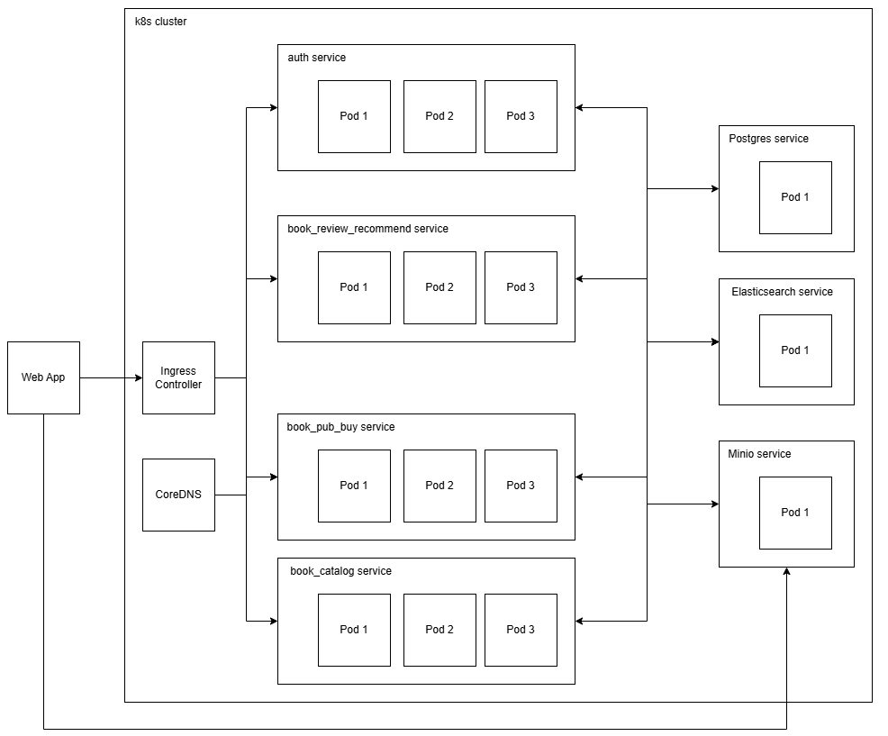

## Distributed Systems Project: BookVerse

  

### About Project

BookVerse is a website which allows users to read, like, review, download, publish and buy books. We also offer free books and users can publish their own books and sell them. We want to give book lovers access to books worldwide and encourage authors to publish and make money. BookVerse is a book library which brings together both readers and publishers.

### features

- Search books by title, author, description, subjects
- read, like and download books
- rate and review books
- recommend books
- buy and publish books
- show most liked books

Elasticsearch provides fast text based search for searching book by title, author, description, subjects  

Minio is the object storage for storing PDFs, cover images and book metadata JSON files

PostgreSQL is the database for storing structured data  

### Dev Setup

service map:

8001 - auth  
8002 - book_catalog  
8003 - book_pub_buy  
8004 - book_review_recommend    

- run `pip install -r requirements.txt`
- run `docker compose up -d`  
- run `python data_setup.py` inside init_data/src with with IS_PROD=False
- run `uvicorn api:app --host 0.0.0.0 --port 8001 --reload` inside auth
- run `uvicorn api:app --host 0.0.0.0 --port 8002 --reload` inside book_catalog
- run `uvicorn api:app --host 0.0.0.0 --port 8003 --reload` inside book_pub_buy
- run `uvicorn api:app --host 0.0.0.0 --port 8004 --reload` inside book_review_recommend
- run `npm install` in bookverse_ui
- run `npm start` in bookverse_ui

### Prod Setup

use k8s_deployment for production deployment

- open docker desktop
- Go to Settings > Kubernetes
- Check “Enable Kubernetes”
- Click “Apply & Restart”
- Wait until the Kubernetes status turns "Running"
- `cd k8s_deployment`
- `kubectl apply -f https://raw.githubusercontent.com/kubernetes/ingress-nginx/controller-v1.12.2/deploy/static/provider/cloud/deploy.yaml` (only once)
- `kubectl apply -f .` (if any error shown, run again)
- check pod status: `kubectl get pods --all-namespaces`
- check services: `kubectl get svc --all-namespaces`
- in bookverse_ui/backend_links.js set `prod = true`
- run `npm install` in bookverse_ui
- run `npm start` in bookverse_ui

clean up resources:  

- `kubectl delete all --all -n ingress-nginx`
- `kubectl delete all --all -n bookverse`